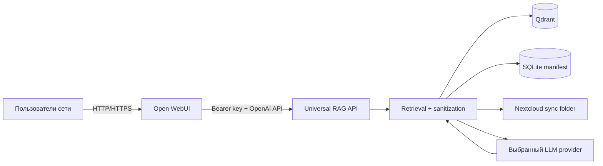

# Universal RAG

Universal RAG — внутренний сервис поиска и ответов по корпоративным документам. Документы и
retrieval остаются на сервере компании; перед обращением к внешней LLM чувствительные значения
заменяются обратимыми маркерами, а восстановление ответа выполняется внутри корпоративного
контура.

Интерфейс проекта — Open WebUI. Он отвечает за пользователей, историю диалогов, группы,
доступность моделей и работу через браузер. Universal RAG подключается к нему как отдельная
модель через OpenAI-совместимый API.

**Материалы:** [интерактивная схема](ARCHITECTURE.drawio.html) ·
[архитектурные границы](docs/ARCHITECTURE.md) · [эксплуатация](deploy/README.md) ·
[работа с состоянием](docs/OPERATIONS.md)

## Целевая схема



Open WebUI не получает прямой доступ к Nextcloud, Qdrant, manifest или Marker Vault. Backend
отдаёт браузеру только восстановленный ответ и локальную карту источников. Provider видит
санитизированный вопрос, санитизированные фрагменты, тип файла и непрозрачные ссылки `R001`,
но не видит реальный путь или имя файла.

## Что уже реализовано

- инкрементальная индексация TXT, Markdown, CSV, JSON, XML, HTML, DOCX, XLSX, PPTX и PDF;
- E5 embeddings и Qdrant с обязательным policy-фильтром внутри vector search;
- SQLite manifest с ревизиями документов, offsets и build history;
- regex + NER, единое пространство маркеров, fail-closed outbound и строгий demarking;
- повторный multi-query retrieval и расширение соседних chunks по проверенному protocol;
- OpenAI-совместимые `GET /v1/models` и `POST /v1/chat/completions`;
- Open WebUI `v0.11.1` с постоянным volume для аккаунтов, настроек и истории;
- PowerShell lifecycle scripts, GitHub Actions CI и pull-based deployment на self-hosted runner.

Это рабочая продуктовая база, но ещё не законченная DLP/ACL-платформа. Перед доступом разных
подразделений нужно связать Open WebUI identity с document-level ACL, зашифровать Marker Vault,
добавить SSO/HTTPS, проверить NER на согласованном security-наборе и провести restore drill.

## Быстрый запуск

Требуются Windows, Python 3.12 x64 и Docker Desktop.

```powershell
py -3.12 -m venv .venv
.\.venv\Scripts\python.exe -m pip install --upgrade pip
.\.venv\Scripts\python.exe -m pip install -e ".[web,dev]"
Copy-Item .env.example .env
```

В `.env` задайте:

- `SECURE_RAG_SOURCE_ROOT` — локальный read-only каталог синхронизации Nextcloud;
- `SECURE_RAG_API_KEY` — длинный случайный ключ между Open WebUI и backend;
- `OPEN_WEBUI_SECRET_KEY` — другой случайный ключ сессий Open WebUI;
- `OPEN_WEBUI_URL` — адрес вида `http://10.0.0.25:3000`;
- provider credentials, если используется внешняя LLM.

Реальные секреты никогда не коммитятся. После настройки:

CLI автоматически читает корневой `.env`; уже заданные системные переменные имеют приоритет.

```powershell
.\scripts\start-local.ps1
.\scripts\status-local.ps1
.\scripts\stop-local.ps1
```

Open WebUI доступен на `http://<server-ip>:3000`. Первый зарегистрированный пользователь
становится администратором; после этого регистрация автоматически закрывается. Новых
пользователей и группы администратор создаёт и подтверждает в Open WebUI.

API запускается нативным Windows-процессом, чтобы использовать GPU и локальный каталог
Nextcloud. Open WebUI и Qdrant работают в Docker. Shared backend key остаётся только в `.env`
сервера и не выдаётся пользователям.

## Индексация Nextcloud

Первый deployment profile использует Nextcloud Desktop Client или управляемый файловый mount.
Он синхронизирует разрешённые каталоги на серверный ПК, а `SECURE_RAG_SOURCE_ROOT` указывает на
их локальную read-only копию. Nextcloud credentials не передаются в Open WebUI или LLM.

```powershell
.\.venv\Scripts\python.exe -m secure_rag.api.cli doctor
$env:SECURE_RAG_HF_LOCAL_ONLY = "0"
.\.venv\Scripts\python.exe -m secure_rag.api.cli prepare-models --ner all
$env:SECURE_RAG_HF_LOCAL_ONLY = "1"
.\.venv\Scripts\python.exe -m secure_rag.api.cli index --max-files 0
```

Повторный запуск `index --max-files 0` обрабатывает только новые и изменившиеся ревизии.
`--prune-missing` разрешён лишь после полного scan заведомо доступного источника. Позже
file-scan можно заменить Nextcloud/WebDAV change feed, не меняя downstream pipeline.

## Open WebUI и модели

Universal RAG появляется в selector как модель `universal-rag`. Другие локальные или внешние
модели подключаются администратором Open WebUI отдельно; группы определяют, кому они доступны.
Open WebUI хранит историю, поэтому его volume содержит исходные вопросы и восстановленные
ответы и считается конфиденциальным.

Текущий backend намеренно использует только последнее пользовательское сообщение. История
видна пользователю и хранится в Open WebUI, но не пересылается в RAG/provider: это не позволяет
случайно вернуть восстановленные значения из прошлого ответа за privacy boundary. Безопасный
multi-turn context с повторной маркировкой — отдельный следующий этап.

Файлы, загруженные в стандартный Open WebUI uploader, пока не маршрутизируются в Universal
RAG. Документы поступают через индексируемый Nextcloud-каталог. Произвольный доступ к desktop,
терминалу или файловой системе серверного ПК также не включён: будущие инструменты должны
проходить через узкий allowlisted gateway и проверку роли пользователя.

Open WebUI используется без изменения его официального брендинга. Это соответствует его
[условиям для внутреннего использования](https://docs.openwebui.com/license/); перед
white-labeling или масштабированием нужно повторно проверить лицензионные условия.

## Код и данные

```text
src/secure_rag/
├── api/              # CLI и OpenAI-compatible HTTP API
├── domain/           # типизированные контракты
├── infrastructure/   # политики сторонних runtime-библиотек
├── ingestion/        # inventory, extraction, chunks, manifest, index sync
├── llm/              # provider contracts, adapters и privacy bridge
├── orchestration/    # online pipeline и безопасные события
├── retrieval/        # embeddings, Qdrant и source rehydration
├── sanitization/     # regex/NER, markers, normalization, demarking
├── security/         # fail-closed retrieval policy
├── composition.py    # сборка concrete components
└── config.py         # YAML/env configuration
```

```text
runtime/
├── data/          # SQLite manifest; embedded vectors только по явной настройке
├── state/         # Marker Vault и request workspaces
├── cache/         # модели и пересоздаваемые cache
├── diagnostics/   # безопасные логи и отчёты
├── run/           # PID и locks
└── tmp/           # одноразовые workspace
```

Git хранит код, schema/config, migration logic и документацию. Live SQLite, Qdrant volume,
Open WebUI history, модели и документы в Git не попадают. Их версия связывается через Git
commit, config schema, index signature, build ID и snapshot metadata. Команда создания
согласованной копии состояния описана в [docs/OPERATIONS.md](docs/OPERATIONS.md).

## Командная разработка и CI/CD

```powershell
.\.venv\Scripts\python.exe -m ruff check src tests
.\.venv\Scripts\python.exe -m pytest
```

Pull request и каждый push в `main` проходят Ruff, тесты и проверку Compose. После успешного
CI job `deploy` запускается на Windows self-hosted runner с label `universal-rag`. Runner
должен иметь системную переменную `UNIVERSAL_RAG_DEPLOY_ROOT`, указывающую на отдельный
постоянный clone. Workflow не делает `actions/checkout` поверх deployment-каталога, поэтому
не может удалить `.env` или `runtime/` командой очистки workspace.

Автодеплой выключен, пока в GitHub repository variables не задано
`ENABLE_INTERNAL_DEPLOY=true`.

Настройка production runner, rollback и backup/restore собраны в
[deploy/README.md](deploy/README.md). Label Studio будет отдельным сервисом и отдельной задачей:
его пользователей, проекты, PostgreSQL и storage нельзя смешивать с Open WebUI volume.
